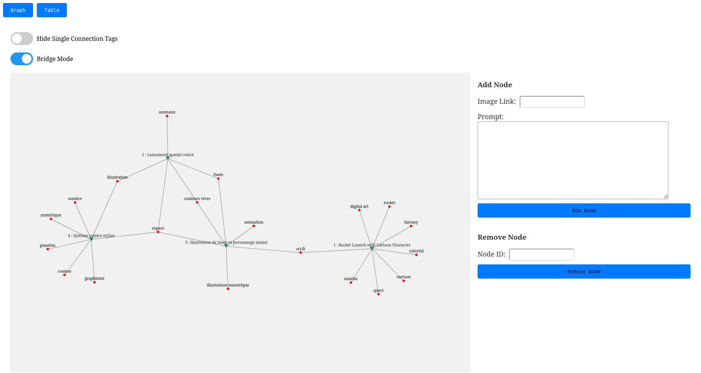
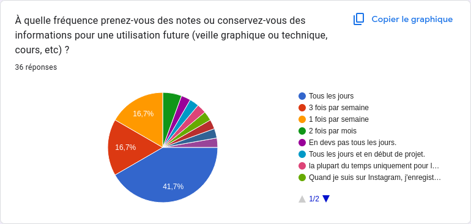

---
author: Guillaume Calderon, Thibaut Laracine, Eymeric Dechelette
titlepage: true
toc: true
toc-own-page: true
title: "Business Plan : All-In"
date: 1er Avril 2025
titlepage-logo: "logo.png"
logo-width: 300px

...

## Executive Summary

All-In est une plateforme SaaS innovante conçue pour résoudre un problème majeur chez les designers : la dispersion et la perte d'inspiration collectée sur de multiples plateformes (Instagram, Pinterest, Behance, etc.). En France, 70% des 55 000 designers perdent jusqu'à un jour par semaine à retrouver ces éléments sauvegardés. All-In centralise, organise intelligemment (via tagging automatique et potentiellement IA) et permet de redécouvrir ces inspirations grâce à une interface visuelle unique en forme de graphe/nœuds. Le modèle économique est Freemium, avec des offres adaptées aux indépendants, PME et grandes entreprises. Validé par une forte traction initiale (7 précommandes en 48h sur 30 contacts), le projet vise 10 000 utilisateurs et 60 000€ de CA en Année 1, avec une expansion rapide vers d'autres métiers créatifs et à l'international, ciblant 65 000 utilisateurs et ~200 000€ de CA en Année 3. Le projet est porté par une équipe pluridisciplinaire expérimentée.

## Origine de l’Opportunité

### Public Ciblé
Principalement les designers graphiques, UI/UX, etc. (marché français de 55 000 professionnels, multiplié par 5 depuis 2002). Le besoin est crucial : 70% d'entre eux luttent avec la gestion de leur veille et inspiration, entraînant une perte de temps considérable (estimée à 1 jour/semaine). Le marché secondaire inclut architectes, community managers, vidéastes, etc.

### Nouveauté
All-In se distingue par sa capacité à non seulement centraliser le contenu de diverses sources, mais surtout à l'organiser intelligemment et à le restituer de manière connectée et visuelle (vue en graphe), facilitant la redécouverte et l'émergence de nouvelles idées. Contrairement aux outils existants, elle est spécifiquement conçue pour le flux de travail de veille créative.

### Équipe Fondatrice
Le projet est porté par une "équipe de choc" combinant des compétences clés : design, développement logiciel, marketing digital. Cette complémentarité est un atout majeur pour le développement et la commercialisation d'All-In.

## Description du Projet

### Métier de l’Entreprise
Développement et exploitation d'une plateforme SaaS (Software as a Service) de gestion et de valorisation de l'inspiration créative.

### Fonctionnalités Clés
* Capture facile depuis diverses plateformes (via "Partager vers All-In" ou extension navigateur).
* Centralisation de contenus variés (images, liens, vidéos, articles).
* Organisation automatique : tagging intelligent, catégorisation.
* Visualisation en graphe : exploration des connexions entre les inspirations.
* Recherche avancée par mots-clés, tags, projets, description interprétée.
* Fonctionnalités collaboratives (partage d'espaces, de groupes d'inspiration) pour les offres premium.
* Potentiel d'intégration d'IA pour des suggestions et analyses plus poussées et une recherche plus intelligente.

### Modèle Économique
Freemium :
* **Offre Gratuite :** Fonctionnalités de base (capture, organisation limitée, stockage restreint) pour attirer une large base d'utilisateurs.
* **Offre Standard (15€/mois) :** Pour indépendants et PME. Fonctionnalités complètes pour un usage individuel.
* **Offre Premium (25€/mois/utilisateur) :** Pour agences et entreprises. Inclut des fonctionnalités collaboratives avancées (espaces partagés, gestion d'équipe).

## Étude du Marché

### Concurrence
* **Solutions Actuelles :** Les designers utilisent souvent des outils de prise de notes (Notion, Evernote), de sauvegarde de liens (Pocket), ou les fonctions natives des plateformes (tableaux Pinterest, collections Instagram).

Voici leur avantage et incovenients :

--------------------------------------------------------------------------------------------------------------------------------
      Concurrent       Avantages                                              Inconvénients par rapport à All-In
---------------------- ------------------------------------------------------ --------------------------------------------------
      **Notion**       - Très flexible et personnalisable.                    - Ne centralise pas automatiquement les inspirations depuis diverses plateformes.
                       - Large communauté et nombreuses intégrations.         - Pas de visualisation en graphe pour explorer les connexions entre les inspirations.
                       - Bon pour la gestion de projets et la prise de notes. - Moins spécialisé pour les designers et la veille créative.

      **Evernote**     - Capture facile de notes et de contenus web.          - Interface moins visuelle et intuitive pour les designers.
                       - Organisation par carnets et tags.                    - Pas de fonctionnalités avancées de visualisation ou de suggestion basée sur l'IA.
                       - Recherche puissante dans les notes.                  - Moins adapté à la collaboration en temps réel.

      **Pocket**       - Sauvegarde rapide de liens et d'articles.            - Limité à la sauvegarde de liens et d'articles, pas d'images ou de vidéos.
                       - Interface simple et épurée.                          - Pas de fonctionnalités de tagging automatique ou de suggestion.
                       - Synchronisation multi-appareils.                     - Ne permet pas la visualisation en graphe ou l'exploration des connexions.

      **Pinterest**    - Très visuel et inspirant.                            - Pas de centralisation automatique depuis d'autres plateformes.
                       - Large base d'utilisateurs et de contenus.            - Pas de fonctionnalités avancées de recherche ou de suggestion basée sur l'IA.
                       - Tableaux pour organiser les inspirations.            - Moins adapté à la gestion de projets ou à la collaboration.

      **Instagram**    - Plateforme très populaire pour les designers.        - Pas de centralisation ou d'organisation automatique des inspirations.
                       - Collections pour sauvegarder des posts.              - Pas de visualisation en graphe ou de suggestion basée sur l'IA.
                       - Forte communauté et engagement.                      - Moins adapté à la gestion de projets ou à la collaboration.

      **Behance**      - Plateforme dédiée aux créatifs.                      - Pas de fonctionnalités de centralisation ou d'organisation des inspirations.
                       - Portfolios et projets inspirants.                    - Pas de visualisation en graphe ou de suggestion basée sur l'IA.
                       - Communauté active et feedback.                       - Moins adapté à la gestion de projets ou à la collaboration en temps réel.
-----------------------------------------------------------------------------------------------------------------

* **Positionnement d'All-In :** Ces outils sont des concurrents *indirects*. Ils permettent de stocker mais ne résolvent pas le problème central de la *restitution connectée et visuelle* de l'inspiration multi-sources, spécifique au besoin des créatifs. All-In vise un segment "orphelin" avec une solution dédiée et spécialisée.

### Cible
* **Profil :** Designers professionnels (freelances, agences, entreprises). Marché en croissance. Forte sensibilité à l'efficacité et aux outils améliorant le processus créatif.
* **Besoin Identifié :** Perte de temps, frustration liée à la dispersion des inspirations, sous-exploitation de la veille effectuée. 73% des entreprises investissent dans le design, soulignant l'importance de l'efficacité des designers.
* **Validation :** L'étude initiale (30 contacts -> 7 précommandes immédiates) confirme l'existence du besoin et la volonté de payer pour une solution efficace. L'approche de co-conception avec 350 testeurs permettra d'affiner le produit et de construire une communauté.

### Autres Parties Prenantes
* **Fournisseurs :** Principalement fournisseurs de services Cloud (AWS, Google Cloud, Azure) pour l'hébergement et le stockage ainsi que principal fournisseurs de services ia (mistral AI, openAI).
* **Financeurs :** Investissement par les créateurs à hauteur de 200k.
* **Communauté :** Les 350 précurseurs/testeurs jouent un rôle clé dans la validation et l'amélioration du produit.

## Stratégie de Lancement

### Offre
* **Produit :** Plateforme SaaS web (et potentiellement application mobile future).
* **Adéquation Cible :** Répond directement au besoin de centralisation et de redécouverte efficace de l'inspiration. L'interface visuelle est un atout pour les profils créatifs. Le modèle Freemium permet une adoption large tout en monétisant les utilisateurs professionnels et les équipes.
* **Stratégie de Revenus :** Conversion des utilisateurs gratuits en payants (Standard/Premium), vente directe aux entreprises pour l'offre Premium.

### Politique Marketing
* **Positionnement :** La solution incontournable pour les designers qui veulent transformer leur veille passive en inspiration active et organisée.
* **Communication & Acquisition :**
    * Phase 1 : Co-conception avec 350 testeurs pour générer du feedback, des ambassadeurs et du contenu. Utilisation de la preuve sociale (précommandes).
    * Phase 2 (Lancement) : Marketing de contenu (blog, tutoriels), présence active sur les réseaux sociaux et communautés de designers (LinkedIn, Behance, Dribbble), SEO ciblé, potentiellement publicité en ligne. Relations presse spécialisée.
    * Phase 3 (Croissance) : Partenariats (écoles de design, associations professionnelles), marketing d'influence.
* **Canaux de Distribution :** Principalement via le site web d'All-In. Potentiellement via des marketplaces d'outils pour designers.
* **Prix et Marges :** Prix fixés à 0€, 15€, 25€. Le tableau financier initial indique une Marge Brute de 68%, ce qui est un bon indicateur pour un SaaS, bien que les coûts d'acquisition client devront être maîtrisés.

### Organisation
* **Production :** Développement logiciel interne par l'équipe technique. Méthodologie agile favorisée par la co-conception.
* **Fournisseurs :** Sélection et gestion des fournisseurs de services cloud.
* **Stockage :** Infrastructure cloud scalable pour gérer la croissance des données utilisateurs.
* **Distribution :** Plateforme en ligne, support client.
* **RH :** Équipe fondatrice en place. Prévoir recrutements pour le support client, le développement continu, le marketing et la vente (notamment pour l'offre entreprise) au fur et à mesure de la croissance.
* **Investissements :** Coûts initiaux de développement, budget marketing de lancement, infrastructure, frais opérationnels avant rentabilité.

### Analyse des Risques
* **Risque Marché :** Adoption plus lente que prévue, difficulté à convertir les utilisateurs gratuits, réaction rapide des concurrents indirects, évolution des besoins des designers.
* **Risque Technique :** Complexité du développement (notamment l'interface graphe et l'intégration multi-plateformes), scalabilité de l'infrastructure, sécurité des données.
* **Risque Financier :** Dépassement des coûts de développement ou d'acquisition client, rentabilité retardée, besoin de financement supérieur aux prévisions (au-delà des 20k€ initiaux).
* **Risque Opérationnel :** Difficulté à gérer la croissance rapide, maintien de la qualité du support client, dépendance aux API des plateformes sources.

## Prévisions Financières

### Estimation du CA, Rentabilité et Croissance
* **Croissance Utilisateurs :** L'objectif est d'atteindre 10 000 utilisateurs en Année 1, avec une croissance significative pour atteindre 40 000 utilisateurs en Année 2, puis 65 000 utilisateurs en Année 3. Cette croissance repose sur l'acquisition sur le marché initial des designers, puis l'expansion vers de nouveaux métiers créatifs et l'internationalisation.
* **Chiffre d'Affaires (CA) :** Les prévisions de revenus sont les suivantes :
    * Année 1 : 60 000 €
    * Année 2 : 362 000 €
    * Année 3 : 200 000 €
* **Analyse de la Tendance du CA :** Après une forte croissance entre l'Année 1 et l'Année 2, le modèle prévoit une **baisse notable du CA en Année 3**, malgré une augmentation prévue du nombre d'utilisateurs. **Clarification critique :** L'explication fournie (prise de salaires par les fondateurs) justifie une baisse de la *rentabilité*, pas du *chiffre d'affaires*. Cette baisse de CA doit être justifiée par d'autres facteurs (par exemple, une stratégie agressive de conversion gratuite, une baisse des prix, une modification du mix produit) ou revue car elle contredit la croissance en utilisateurs.
* **Rentabilité :**
    * La rentabilité initiale (Année 1) sera probablement faible ou nulle, comme le suggère le CA modeste de 60k€ (correspondant au tableau financier initial qui montrait un EBE de 199€ et un Point Mort à 60k€).
    * L'Année 2 montre une forte augmentation du CA, suggérant une amélioration significative de la rentabilité (le tableau initial indiquait un EBE de 171k€, soit 47% du CA).
    * En Année 3, la baisse du CA à 200k€, combinée à l'augmentation des charges (notamment les salaires mentionnés), entraînera baisse de la rentabilité*par rapport à l'Année 2. L'EBE pourrait se rapprocher de celui indiqué dans le tableau initial pour l'Année 3 (27k€, soit 13% du CA de 210k€, un chiffre proche des 200k€ révisés). Le seuil de rentabilité (Point Mort) deviendra plus difficile à atteindre.
* **Croissance Globale :** Le projet affiche une stratégie de croissance ambitieuse en termes d'acquisition d'utilisateurs et d'expansion de marché. Cependant, la projection financière pour l'Année 3 marque une rupture dans la croissance du revenu, ce qui nécessite une justification stratégique solide ou une révision des prévisions. La capacité à financer la croissance continue malgré une baisse de CA et de rentabilité en Année 3 sera un point clé.

### Estimation du Besoin de Démarrage
* Pour lancer l'activité et couvrir les premières dépenses avant la génération de revenus significatifs, **un capital de démarrage initial de 20 000 € est prévu.**
* Ce montant sera apporté en fonds propres par les fondateurs
* Ces fonds serviront principalement à couvrir les frais initiaux de développement (finalisation du MVP/V1), les coûts d'infrastructure de base (hébergement), les premières actions marketing pour acquérir les testeurs et les premiers clients payants, ainsi que les frais administratifs de création.
* Ce financement initial permettra de tenir le temps de trouver des clients et de valider la traction commerciale.
* **Note :** En fonction de la vitesse d'acquisition client, de la réalisation des prévisions de CA (notamment la clarification de la tendance en Année 3) et des ambitions de croissance (expansion rapide, internationalisation), des besoins de financement complémentaires (levée de fonds auprès d'investisseurs externes) pourraient s'avérer nécessaires ultérieurement pour soutenir le développement à plus grande échelle.

### Logique des Budgets
Allocation nécessaire pour :
* R&D : Développement continu, maintenance, innovation (IA).
* Marketing & Ventes : Acquisition client, communication, salaires équipe commerciale.
* Opérations : Hébergement cloud, platform ia, support client, outils internes.
* Frais Généraux & Administratifs: frais juridiques, comptables, salaires administratifs.

## Annexes

# **Annexes**

Cette section regroupe les documents et informations complémentaires venant appuyer les éléments présentés dans le corps du business plan.

## Annexe 1 : Maquettes et Captures d'Écran de l'Interface All-In

## Annexe 2 : Parcours Utilisateur Type

Voici un exemple de parcours utilisateur typique pour un designer utilisant All-In :

1.  **Découverte (Lundi Matin) :**
    * Léa, designer freelance, navigue sur Instagram et repère un logo qui l'inspire pour un projet futur.
    * Elle utilise l'extension navigateur All-In (ou la fonction "Partager vers" sur mobile) pour sauvegarder le post directement dans son espace All-In.
    * All-In capture l'image, le lien source, et suggère automatiquement des tags pertinents ("logo", "minimaliste", "typographie"). Léa ajoute le tag "Projet_ClientX".
2.  **Veille Continue (Lundi Soir) :**
    * Léa consulte Pinterest et trouve une palette de couleurs intéressante. Elle la sauvegarde dans All-In, la reliant au tag "Projet_ClientX".
    * Elle lit un article de blog sur les tendances design 2025 et sauvegarde le lien dans All-In avec le tag "Tendances_2025".
3.  **Phase de Réflexion (Mardi Après-midi) :**
    * Léa démarre activement le "Projet_ClientX". Elle ouvre All-In et filtre ses inspirations par ce tag.
    * Elle active la vue en graphe pour visualiser les éléments sauvegardés pour ce projet. Elle voit le logo Instagram, la palette Pinterest et d'autres éléments liés.
    * Le graphe met en évidence une connexion inattendue entre le logo et un autre élément sauvegardé précédemment sous un tag différent ("inspiration_forme").
4.  **Utilisation & Création (Mardi Soir) :**
    * Léa explore cette connexion et affine son concept créatif. Elle exporte facilement les visuels nécessaires depuis All-In pour les utiliser dans ses outils de design.
    * Elle gagne du temps en ayant tout centralisé et bénéficie de la visualisation pour stimuler sa créativité.
5.  **Collaboration (Optionnel - Offre Premium) :**
    * Si Léa travaillait en équipe, elle pourrait partager son groupe d'inspiration "Projet_ClientX" avec ses collaborateurs directement dans All-In pour discussion et validation.

## Annexe 3 : Résultats Détaillés de l'Étude de Marché Initiale

Cette section détaillerait les résultats du sondage initial et de la démarche de validation :

1.  **Résumé des Chiffres Clés :**
    * Marché Cible Primaire (France) : ~55 000 designers.
    * Problème Identifié : 70% déclarent avoir des difficultés à retrouver/gérer leurs inspirations sauvegardées.
    * Temps Perdu Estimé : Jusqu'à 1 jour par semaine pour certains.
    * Validation Initiale : 30 designers contactés -> 7 précommandes (Offre Standard ou Premium) enregistrées en 48h, validant l'appétence et la volonté de payer.
    * Communauté de Testeurs : Objectif de 350 "précurseurs" pour la phase de co-conception.
2.	**Enquête**:

3.  **Précommandes :** 7 précommandes à 5 euro pour rejoindre les early adopters.

## Annexe 4 : Prévisions Financières Détaillées

Cette annexe contiendrait les tableaux financiers prévisionnels complets sur une période de 3 à 5 ans :

1.  **Compte de Résultat Prévisionnel :** Détaillant les revenus (par offre : Gratuit, Standard, Premium), les coûts directs (hébergement, support...), la marge brute, les frais opérationnels (R&D, Marketing & Ventes, Frais Généraux & Administratifs), l'EBE (Excédent Brut d'Exploitation), l'amortissement, le Résultat d'Exploitation (Rex), les charges financières, l'impôt sur les sociétés, et le Résultat Net.
2.  **Bilan Prévisionnel :** Présentant l'évolution des actifs (immobilisations, créances clients, trésorerie) et des passifs (capital social, réserves, dettes fournisseurs, dettes financières éventuelles).
3.  **Plan de Trésorerie Prévisionnel (Mensuel pour la 1ère année) :** Suivi détaillé des encaissements et décaissements pour anticiper les besoins et excédents de trésorerie. Essentiel pour piloter l'activité.
4.  **Hypothèses Clés (Crucial) :** Liste exhaustive et justification des hypothèses sous-jacentes aux prévisions :
    * Taux de croissance du nombre d'utilisateurs (total, et par offre).
    * Taux de conversion du gratuit vers le payant.
    * Revenu Moyen Par Utilisateur Payant (ARPU).
    * Coût d'Acquisition Client (CAC).
    * Coûts d'hébergement par utilisateur.
    * Masse salariale prévisionnelle (incluant les salaires des fondateurs à partir de l'An 3).
    * Budgets marketing et R&D.
    * **Justification de la trajectoire du CA (notamment la baisse en An 3)** : Cette section devrait expliquer précisément pourquoi le CA baisse malgré la croissance utilisateurs (ex: changement de stratégie tarifaire, impact d'une offre gratuite très large, etc.).
