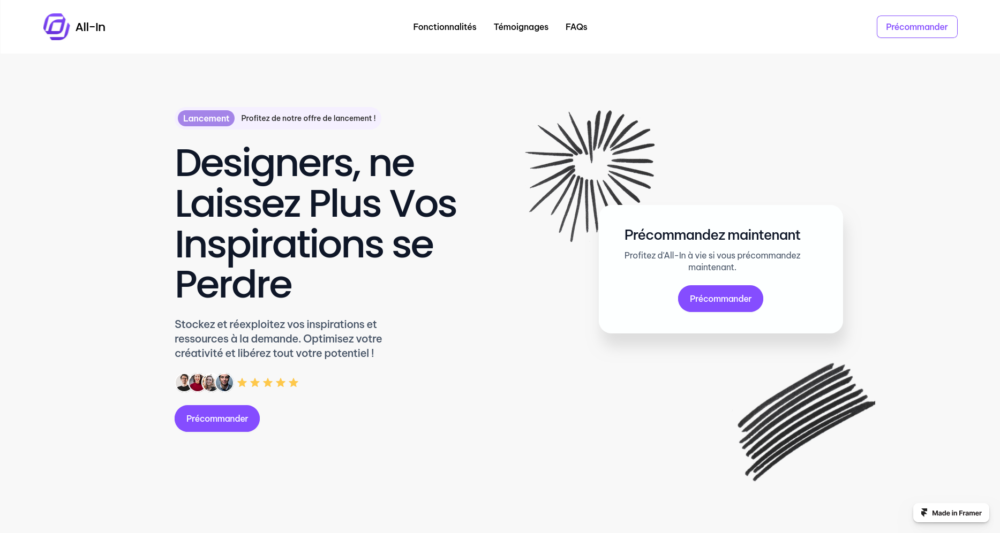
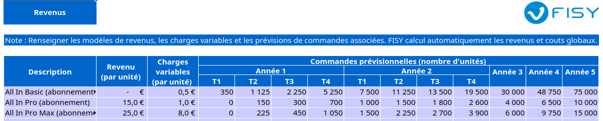
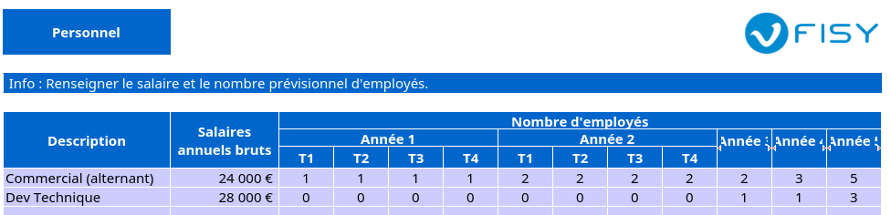
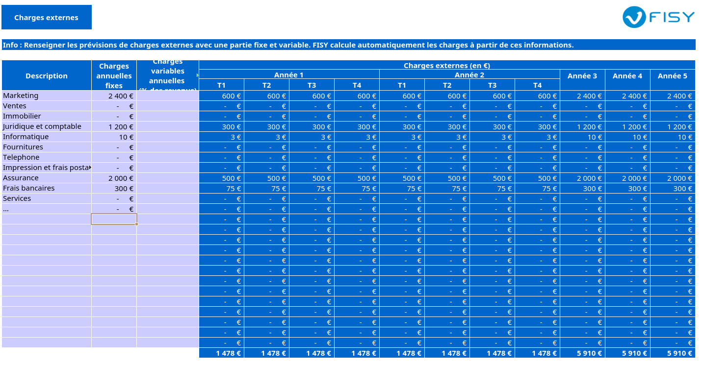
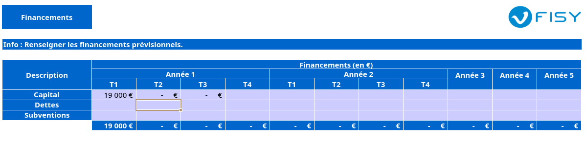

---
author: Guillaume Calderon, Thibaut Laracine, Eymeric Dechelette
titlepage: true
toc: true
toc-own-page: true
title: "Business Plan : Apolline"
date: 1er Avril 2025
titlepage-logo: "logo.png"
logo-width: 300px

...

## Executive Summary

Apolline est une plateforme SaaS innovante conçue pour résoudre un problème majeur chez les designers : la dispersion et la perte d'inspiration collectée sur de multiples plateformes (Instagram, Pinterest, Behance, etc.). En France, 70% des 55 000 designers perdent jusqu'à un jour par semaine à retrouver ces éléments sauvegardés. Apolline centralise, organise intelligemment (via tagging automatique et potentiellement IA) et permet de redécouvrir ces inspirations grâce à une interface visuelle unique en forme de graphe/nœuds. Le modèle économique est Freemium, avec des offres adaptées aux indépendants, PME et grandes entreprises. Validé par une forte traction initiale (7 précommandes en 48h sur 30 contacts), le projet vise 10 000 utilisateurs et 60 000€ de CA en Année 1, avec une expansion rapide vers d'autres métiers créatifs et à l'international, ciblant 65 000 utilisateurs et ~200 000€ de CA en Année 3. Le projet est porté par une équipe pluridisciplinaire expérimentée.

## Origine de l’Opportunité

### Public Ciblé

Notre solution s'adresse principalement aux designers graphiques, UI/UX et autres professionnels créatifs. Le marché français compte environ 55 000 professionnels dans ce domaine, un chiffre qui s'est multiplié par 5 depuis 2002. Le besoin auquel nous répondons est crucial : 70% de ces designers luttent quotidiennement avec la gestion de leur veille et de leurs sources d'inspiration, ce qui entraîne une perte de temps considérable, estimée à environ 1 jour par semaine. Notre marché secondaire inclut également d'autres professions créatives comme les architectes, les community managers, les vidéastes, et d'autres métiers similaires confrontés aux mêmes défis.

### Nouveauté
Apolline se distingue par sa capacité à non seulement centraliser le contenu de diverses sources, mais surtout à l'organiser intelligemment et à le restituer de manière connectée et visuelle (vue en graphe), facilitant la redécouverte et l'émergence de nouvelles idées. Contrairement aux outils existants, elle est spécifiquement conçue pour le flux de travail de veille créative.

### Équipe Fondatrice
Le projet est porté par une "équipe de choc" combinant des compétences clés : design, développement logiciel, marketing digital. Cette complémentarité est un atout majeur pour le développement et la commercialisation d'Apolline.

## Description du Projet

### Métier de l’Entreprise
Apolline se positionne comme une entreprise innovante spécialisée dans le développement et l'exploitation d'une plateforme SaaS (Software as a Service) dédiée à la gestion et à la valorisation de l'inspiration créative. Notre mission consiste à offrir aux professionnels du design un outil performant qui transforme leur processus de veille et d'idéation en une expérience fluide et productive. Nous permettons à nos utilisateurs de centraliser, organiser et redécouvrir leurs sources d'inspiration grâce à des fonctionnalités avancées et une interface visuelle unique.

### Fonctionnalités Clés
Voici les fonctionnalités clés qu'offre notre plateforme Apolline pour transformer l'expérience des designers :

* Capture facile depuis diverses plateformes (via "Partager vers Apolline" ou extension navigateur).
* Centralisation de contenus variés (images, liens, vidéos, articles).
* Organisation automatique : tagging intelligent, catégorisation.
* Visualisation en graphe : exploration des connexions entre les inspirations.
* Recherche avancée par mots-clés, tags, projets, description interprétée.
* Fonctionnalités collaboratives (partage d'espaces, de groupes d'inspiration) pour les offres premium.
* Potentiel d'intégration d'IA pour des suggestions et analyses plus poussées et une recherche plus intelligente.

### Modèle Économique

Notre modèle économique ce repose sur un système Freemium, avec trois niveaux d'abonnement :

#### Offre Free (0 €/mois)

Pour découvrir le service avec des fonctionnalités de base.

* Enregistrement illimité
* Partage en lecture seule
* 3 requêtes IA par mois
* Classification manuelle

#### Offre Standard (15 €/mois)

Pour les indépendants et petites équipes souhaitant plus d’automatisation.

* Enregistrement illimité
* Partage et édition collaboratifs
* 10 requêtes IA par mois
* Classification automatique

### Offre Illimitée (25 €/mois/utilisateur)

Pour les équipes ou agences avec des besoins avancés.

* Enregistrement illimité
* Espace collaboratif illimité
* Requêtes IA illimitées
* Classification automatique

## Étude du Marché

### Concurrence
Notre analyse de marché montre que l'écosystème d'outils utilisés par les designers présente d'importantes lacunes qu'Apolline vient combler.

* **Solutions Actuelles :** Les designers utilisent souvent des outils de prise de notes (Notion, Evernote), de sauvegarde de liens (Pocket), ou les fonctions natives des plateformes (tableaux Pinterest, collections Instagram).

Voici leur avantage et incovenients :

--------------------------------------------------------------------------------------------------------------------------------
      Concurrent       Avantages                                              Inconvénients par rapport à Apolline
---------------------- ------------------------------------------------------ --------------------------------------------------
      **Notion**       - Très flexible et personnalisable.                    - Ne centralise pas automatiquement les inspirations depuis diverses plateformes.
                       - Large communauté et nombreuses intégrations.         - Pas de visualisation en graphe pour explorer les connexions entre les inspirations.
                       - Bon pour la gestion de projets et la prise de notes. - Moins spécialisé pour les designers et la veille créative.

      **Evernote**     - Capture facile de notes et de contenus web.          - Interface moins visuelle et intuitive pour les designers.
                       - Organisation par carnets et tags.                    - Pas de fonctionnalités avancées de visualisation ou de suggestion basée sur l'IA.
                       - Recherche puissante dans les notes.                  - Moins adapté à la collaboration en temps réel.

      **Pocket**       - Sauvegarde rapide de liens et d'articles.            - Limité à la sauvegarde de liens et d'articles, pas d'images ou de vidéos.
                       - Interface simple et épurée.                          - Pas de fonctionnalités de tagging automatique ou de suggestion.
                       - Synchronisation multi-appareils.                     - Ne permet pas la visualisation en graphe ou l'exploration des connexions.

      **Pinterest**    - Très visuel et inspirant.                            - Pas de centralisation automatique depuis d'autres plateformes.
                       - Large base d'utilisateurs et de contenus.            - Pas de fonctionnalités avancées de recherche ou de suggestion basée sur l'IA.
                       - Tableaux pour organiser les inspirations.            - Moins adapté à la gestion de projets ou à la collaboration.

      **Instagram**    - Plateforme très populaire pour les designers.        - Pas de centralisation ou d'organisation automatique des inspirations.
                       - Collections pour sauvegarder des posts.              - Pas de visualisation en graphe ou de suggestion basée sur l'IA.
                       - Forte communauté et engagement.                      - Moins adapté à la gestion de projets ou à la collaboration.

      **Behance**      - Plateforme dédiée aux créatifs.                      - Pas de fonctionnalités de centralisation ou d'organisation des inspirations.
                       - Portfolios et projets inspirants.                    - Pas de visualisation en graphe ou de suggestion basée sur l'IA.
                       - Communauté active et feedback.                       - Moins adapté à la gestion de projets ou à la collaboration en temps réel.
-----------------------------------------------------------------------------------------------------------------

* **Positionnement :** Ces outils sont des concurrents *indirects*. Ils permettent de stocker mais ne résolvent pas le problème central de la *restitution connectée et visuelle* de l'inspiration multi-sources, spécifique au besoin des créatifs. Apolline vise un segment "orphelin" avec une solution dédiée et spécialisée.

### Cible

* **Profil :** Notre cible principale se compose de designers professionnels, qu'ils soient freelances, travaillant en agences ou intégrés dans des entreprises. Ce marché connaît une croissance soutenue depuis plusieurs années. Les designers démontrent une forte sensibilité à l'efficacité opérationnelle et sont particulièrement réceptifs aux outils innovants capables d'améliorer leur processus créatif au quotidien.

* **Besoin Identifié :** Nous avons clairement identifié une problématique récurrente chez ces professionnels : ils souffrent d'une perte de temps considérable et d'une frustration croissante liée à la dispersion de leurs sources d'inspiration sur différentes plateformes. Cette situation entraîne une sous-exploitation de la veille créative qu'ils effectuent régulièrement. Le fait que 73% des entreprises investissent aujourd'hui dans le design souligne l'importance cruciale de l'efficacité des designers et la valeur économique de notre solution.

* **Validation :** Notre étude initiale, menée auprès de 30 contacts qualifiés et ayant généré 7 précommandes immédiates, confirme de façon tangible l'existence du besoin et la volonté réelle des designers de payer pour une solution efficace. Notre approche de co-conception, qui impliquera 350 testeurs dans le développement du produit, nous permettra non seulement d'affiner notre offre mais également de construire une communauté engagée autour d'Apolline dès son lancement.

### Autres Parties Prenantes
* **Fournisseurs :** Nous collaborerons principalement avec des fournisseurs de services Cloud comme AWS, Google Cloud et Azure pour assurer l'hébergement et le stockage de notre plateforme. Nous établirons également des partenariats avec les principaux fournisseurs de services IA tels que Mistral AI et OpenAI pour optimiser nos fonctionnalités intelligentes.
* **Financeurs :** Le projet bénéficiera d'un investissement initial réalisé par les créateurs qui s'élèvera à 200 000 euros pour soutenir les premières phases de développement et de commercialisation.
* **Communauté :** Notre groupe de 350 précurseurs et testeurs constituera un pilier essentiel dans notre stratégie de développement, car ils joueront un rôle déterminant dans la validation du concept et l'amélioration continue du produit avant son lancement officiel.

## Stratégie de Lancement

### Offre
* **Produit :** Plateforme SaaS web (et potentiellement application mobile future).
* **Adéquation Cible :** Répond directement au besoin de centralisation et de redécouverte efficace de l'inspiration. L'interface visuelle est un atout pour les profils créatifs. Le modèle Freemium permet une adoption large tout en monétisant les utilisateurs professionnels et les équipes.
* **Stratégie de Revenus :** Conversion des utilisateurs gratuits en payants (Standard/Premium), vente directe aux entreprises pour l'offre Premium.

### Stratégie de Présence en Ligne

Notre stratégie de lancement digital s'appuiera sur un site vitrine attractif et efficace, conçu pour présenter notre solution de manière claire et engageante. Ce site sera notre principal point de contact avec nos utilisateurs potentiels et jouera un rôle crucial dans notre stratégie d'acquisition.

[https://allin.framer.website/](https://allin.framer.website/)

Une stratégie SEO robuste sera mise en place pour assurer la visibilité du site auprès de notre cible, avec un contenu optimisé autour des problématiques de gestion d'inspiration et de veille créative. Nous compléterons cette présence par des campagnes publicitaires ciblées sur les plateformes où nos utilisateurs sont actifs, notamment LinkedIn, Instagram et les réseaux spécialisés pour designers.

### Politique Marketing
* **Positionnement :** La solution incontournable pour les designers qui veulent transformer leur veille passive en inspiration active et organisée.
* **Communication & Acquisition :**
    * Phase 1 : Co-conception avec 350 testeurs pour générer du feedback, des ambassadeurs et du contenu. Utilisation de la preuve sociale (précommandes).
    * Phase 2 (Lancement) : Marketing de contenu (blog, tutoriels), présence active sur les réseaux sociaux et communautés de designers (LinkedIn, Behance, Dribbble), SEO ciblé, potentiellement publicité en ligne. Relations presse spécialisée.
    * Phase 3 (Croissance) : Partenariats (écoles de design, associations professionnelles), marketing d'influence.
* **Canaux de Distribution :** Principalement via le site web d'Apolline. Potentiellement via des marketplaces d'outils pour designers.
* **Prix et Marges :** Prix fixés à 0€, 15€, 25€. Le tableau financier initial indique une Marge Brute de 68%, ce qui est un bon indicateur pour un SaaS, bien que les coûts d'acquisition client devront être maîtrisés.

### Organisation
* **Production :** Développement logiciel interne par l'équipe technique. Méthodologie agile favorisée par la co-conception.
* **Fournisseurs :** Sélection et gestion des fournisseurs de services cloud.
* **Stockage :** Infrastructure cloud scalable pour gérer la croissance des données utilisateurs.
* **Distribution :** Plateforme en ligne, support client.
* **RH :** Équipe fondatrice en place. Prévoir recrutements pour le support client, le développement continu, le marketing et la vente (notamment pour l'offre entreprise) au fur et à mesure de la croissance.
* **Investissements :** Coûts initiaux de développement, budget marketing de lancement, infrastructure, frais opérationnels avant rentabilité.

#### Structure Juridique

Après analyse des différentes options et considérant nos objectifs de croissance, notre besoin potentiel de lever des fonds et la nature de notre activité, nous avons opté pour le statut de Société par Actions Simplifiée (SAS). Cette forme juridique offre une grande souplesse dans son organisation et son fonctionnement, ce qui est particulièrement adapté à une jeune entreprise innovante comme Apolline. Elle permet également de faciliter l'entrée d'investisseurs au capital si le besoin s'en fait sentir à l'avenir.

#### Implantation et Cadre de Travail

En tant qu'entreprise développant une solution SaaS, notre infrastructure principale repose sur des services cloud pour l'hébergement de la plateforme et des données utilisateurs. Le siège social d'All-In sera établi à Lyon.

Pour la phase de démarrage, l'équipe fondatrice opérera principalement en travail à distance (full remote), une organisation qui favorise la flexibilité, réduit les coûts initiaux liés aux locaux et permet d'attirer des talents sans contrainte géographique. Des rencontres physiques régulières seront organisées pour maintenir la cohésion d'équipe et pour les sessions de travail stratégiques. Si la croissance de l'entreprise le justifie et que les besoins évoluent, la location de bureaux ou l'accès à des espaces de coworking pourraient être envisagés ultérieurement, notamment pour faciliter certaines fonctions ou accueillir une équipe plus étoffée.

### Analyse des Risques
* **Risque Marché :** Adoption plus lente que prévue, difficulté à convertir les utilisateurs gratuits, réaction rapide des concurrents indirects, évolution des besoins des designers.
* **Risque Technique :** Complexité du développement (notamment l'interface graphe et l'intégration multi-plateformes), scalabilité de l'infrastructure, sécurité des données.
* **Risque Financier :** Dépassement des coûts de développement ou d'acquisition client, rentabilité retardée, besoin de financement supérieur aux prévisions (au-delà des 20k€ initiaux).
* **Risque Opérationnel :** Difficulté à gérer la croissance rapide, maintien de la qualité du support client, dépendance aux API des plateformes sources.

## Prévisions Financières

### Estimation du CA, Rentabilité et Croissance
* **Croissance Utilisateurs :** L'objectif est d'atteindre 10 000 utilisateurs en Année 1, avec une croissance significative pour atteindre 40 000 utilisateurs en Année 2, puis 65 000 utilisateurs en Année 3. Cette croissance repose sur l'acquisition sur le marché initial des designers, puis l'expansion vers de nouveaux métiers créatifs et l'internationalisation.
* **Chiffre d'Affaires (CA) :** Les prévisions de revenus sont les suivantes :
    * Année 1 : 60 000 €
    * Année 2 : 362 000 €
    * Année 3 : 200 000 €
    * Cette baisse s'explique simplement par le fait que nous recruterons 3 personnes à temps plein en Année 3, ce qui augmentera considérablement les charges fixes. Cependant c'est cela qui nous permettra de passer à l'échelle et de nous concentrer sur la croissance du nombre d'utilisateurs.
* **Rentabilité :**
    * La rentabilité initiale (Année 1) sera probablement faible ou nulle, comme le suggère le CA modeste de 60k€ (correspondant au tableau financier initial qui montrait un EBE de 199€ et un Point Mort à 60k€).
    * L'Année 2 montre une forte augmentation du CA, suggérant une amélioration significative de la rentabilité (le tableau initial indiquait un EBE de 171k€, soit 47% du CA).
    * En Année 3, la baisse du CA à 200k€, combinée à l'augmentation des charges (notamment les salaires mentionnés), entraînera baisse de la rentabilité*par rapport à l'Année 2. L'EBE pourrait se rapprocher de celui indiqué dans le tableau initial pour l'Année 3 (27k€, soit 13% du CA de 210k€, un chiffre proche des 200k€ révisés). Le seuil de rentabilité (Point Mort) deviendra plus difficile à atteindre.
* **Croissance Globale :**La trajectoire d'Apolline dessine une évolution stratégique en trois phases distinctes. La première année sera consacrée à l'établissement de notre présence sur le marché français des designers, consolidant notre offre et notre positionnement. L'Année 2 marquera une accélération significative avec une multiplication par 6 du chiffre d'affaires, témoignant de la validation du produit et de l'efficacité de notre stratégie d'acquisition. L'Année 3 représente un tournant stratégique crucial, où nous investirons délibérément dans notre capacité opérationnelle pour préparer l'internationalisation et la diversification vers d'autres métiers créatifs. Cette vision de croissance est soutenue par une augmentation constante du nombre d'utilisateurs, et bien que marquée par une réduction temporaire de la rentabilité en Année 3, elle pose les fondations nécessaires pour un développement exponentiel sur le long terme, avec une projection de croissance annuelle moyenne de +30% du CA à partir de l'Année 4.

### Estimation du Besoin de Démarrage
* Pour lancer l'activité et couvrir les premières dépenses avant la génération de revenus significatifs, **un capital de démarrage initial de 20 000 € est prévu.**
* Ce montant sera apporté en fonds propres par les fondateurs
* Ces fonds serviront principalement à couvrir les frais initiaux de développement (finalisation du MVP/V1), les coûts d'infrastructure de base (hébergement), les premières actions marketing pour acquérir les testeurs et les premiers clients payants, ainsi que les frais administratifs de création.
* Ce financement initial permettra de tenir le temps de trouver des clients et de valider la traction commerciale.
* **Note :** En fonction de la vitesse d'acquisition client, de la réalisation des prévisions de CA (notamment la clarification de la tendance en Année 3) et des ambitions de croissance (expansion rapide, internationalisation), des besoins de financement complémentaires (levée de fonds auprès d'investisseurs externes) pourraient s'avérer nécessaires ultérieurement pour soutenir le développement à plus grande échelle.

### Logique des Budgets
Allocation nécessaire pour :
* R&D : Développement continu, maintenance, innovation (IA).
* Marketing & Ventes : Acquisition client, communication, salaires équipe commerciale.
* Opérations : Hébergement cloud, platform ia, support client, outils internes.
* Frais Généraux & Administratifs: frais juridiques, comptables, salaires administratifs.

## Annexes

# **Annexes**

Cette section regroupe les documents et informations complémentaires venant appuyer les éléments présentés dans le corps du business plan.

## Annexe 1 : Maquettes et Captures d'Écran de l'Interface Apolline

## Annexe 2 : Parcours Utilisateur Type

Voici un exemple de parcours utilisateur typique pour un designer utilisant Apolline :

1.  **Découverte (Lundi Matin) :**
    * Léa, designer freelance, navigue sur Instagram et repère un logo qui l'inspire pour un projet futur.
    * Elle utilise l'extension navigateur Apolline (ou la fonction "Partager vers" sur mobile) pour sauvegarder le post directement dans son espace Apolline.
    * Apolline capture l'image, le lien source, et suggère automatiquement des tags pertinents ("logo", "minimaliste", "typographie"). Léa ajoute le tag "Projet_ClientX".
2.  **Veille Continue (Lundi Soir) :**
    * Léa consulte Pinterest et trouve une palette de couleurs intéressante. Elle la sauvegarde dans Apolline, la reliant au tag "Projet_ClientX".
    * Elle lit un article de blog sur les tendances design 2025 et sauvegarde le lien dans Apolline avec le tag "Tendances_2025".
3.  **Phase de Réflexion (Mardi Après-midi) :**
    * Léa démarre activement le "Projet_ClientX". Elle ouvre Apolline et filtre ses inspirations par ce tag.
    * Elle active la vue en graphe pour visualiser les éléments sauvegardés pour ce projet. Elle voit le logo Instagram, la palette Pinterest et d'autres éléments liés.
    * Le graphe met en évidence une connexion inattendue entre le logo et un autre élément sauvegardé précédemment sous un tag différent ("inspiration_forme").
4.  **Utilisation & Création (Mardi Soir) :**
    * Léa explore cette connexion et affine son concept créatif. Elle exporte facilement les visuels nécessaires depuis Apolline pour les utiliser dans ses outils de design.
    * Elle gagne du temps en ayant tout centralisé et bénéficie de la visualisation pour stimuler sa créativité.
5.  **Collaboration (Optionnel - Offre Premium) :**
    * Si Léa travaillait en équipe, elle pourrait partager son groupe d'inspiration "Projet_ClientX" avec ses collaborateurs directement dans Apolline pour discussion et validation.

## Annexe 3 : Résultats Détaillés de l'Étude de Marché Initiale

Cette section détaillerait les résultats du sondage initial et de la démarche de validation :

1.  **Résumé des Chiffres Clés :**
    * Marché Cible Primaire (France) : ~55 000 designers.
    * Problème Identifié : 70% déclarent avoir des difficultés à retrouver/gérer leurs inspirations sauvegardées.
    * Temps Perdu Estimé : Jusqu'à 1 jour par semaine pour certains.
    * Validation Initiale : 30 designers contactés -> 7 précommandes (Offre Standard ou Premium) enregistrées en 48h, validant l'appétence et la volonté de payer.
    * Communauté de Testeurs : Objectif de 350 "précurseurs" pour la phase de co-conception.
2.	**Enquête**:

3.  **Précommandes :** 7 précommandes à 5 euro pour rejoindre les early adopters.

## Annexe 4 : Prévisions Financières Détaillées

